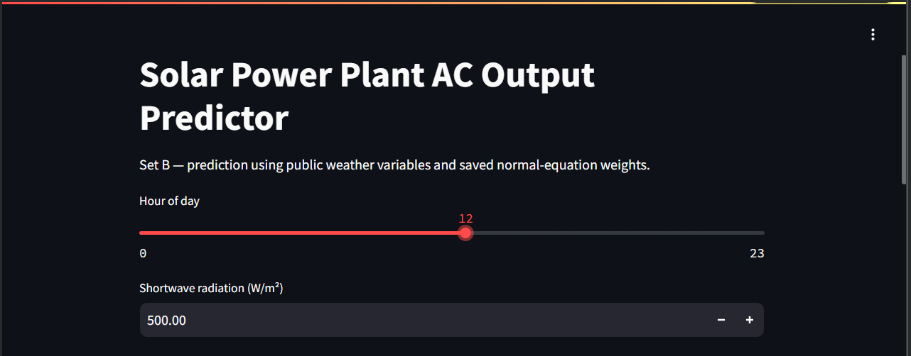
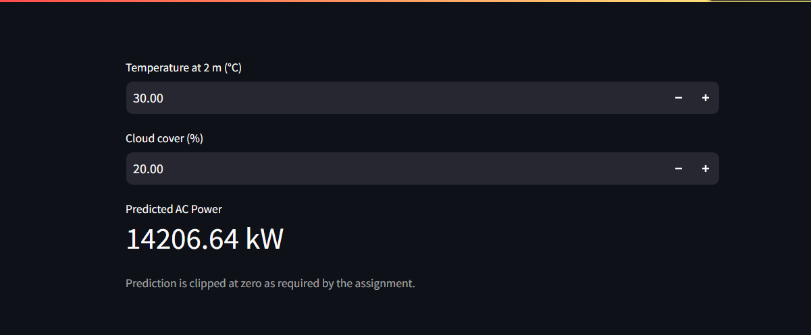

# AI4003 Applied Machine Learning — Assignment 01

## Predicting Solar Power Plant Output from Weather

This repository follows the assignment manual for Fall 2026.

### Important

The project package contains the original four CSV files supplied for this assignment, plus the generated hourly Plant 1 dataset and the Open-Meteo historical weather CSV.

- `Plant_1_Generation_Data.csv`
- `Plant_1_Weather_Sensor_Data.csv`
- `Plant_2_Generation_Data.csv`
- `Plant_2_Weather_Sensor_Data.csv`

Only Plant 1 is used for the analysis, but the manual requires all four raw files in the repository.

## Install

```bash
pip install -r requirements.txt
```

## Run in order

```bash
python src/load_data.py
python src/prepare.py
python src/eda.py
python src/fetch_weather.py
python src/train_eval.py
python src/make_communication.py
```

Then start the front end:

```bash
streamlit run app/app.py
```

## What is generated

- `data/plant1_hourly.csv`
- `data/plant1_openmeteo.csv`
- `results/table1_data_preparation.csv`
- `results/table2_rmse.csv`
- `results/table3_theta_set_a.csv`
- `results/location_peak_check.csv`
- `results/set_b_normal.json`
- `results/analysis.md`
- figures in `results/figures/`
- `communication/medium_blog.md`
- `communication/linkedin_post.md`

## Required repository structure

```text
data/
  Plant_1_Generation_Data.csv
  Plant_1_Weather_Sensor_Data.csv
  Plant_2_Generation_Data.csv
  Plant_2_Weather_Sensor_Data.csv
  plant1_hourly.csv
  plant1_openmeteo.csv

src/
  load_data.py
  prepare.py
  eda.py
  fetch_weather.py
  regression.py
  train_eval.py
  make_communication.py

results/
  analysis.md
  tables and figures
  saved weights

app/
  app.py

communication/
  medium_blog.md
  linkedin_post.md

README.md
requirements.txt
```

## Restrictions respected

The modelling/evaluation implementation uses NumPy and does not use scikit-learn, statsmodels, scipy.stats, or another regression/metric library.

The regression is implemented manually using:

- normal equation
- batch gradient descent
- stochastic gradient descent
- manual RMSE

## Current completion status

The local analysis pipeline has been executed on the supplied data. Open-Meteo data were fetched for 14.82° N, 78.28° E using Asia/Kolkata time and saved as `data/plant1_openmeteo.csv`. The final RMSE tables, regression weights, figures, saved Set B weights, analysis, and communication drafts are included in this package.

External submission steps that still require the student account are publishing the Medium article, publishing the LinkedIn post, creating/pushing the public GitHub repository, adding a real Streamlit screenshot to the README, and making meaningful commits from both team members.
## Frontend

The project includes a Streamlit-based frontend that predicts AC power
using the Set B public weather variables.

### Frontend Inputs



### Prediction Result



## Project Highlights

- Implemented linear regression manually using NumPy.
- Compared the normal equation, batch gradient descent, and stochastic gradient descent.
- Evaluated models using RMSE on all test hours and daytime hours.
- Compared local sensor weather variables with Open-Meteo public weather data.
